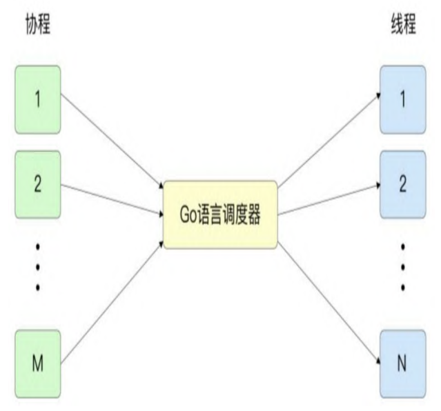

## 进程

进程是一种系统运行行动，它是程序的执行实体。

查询进程： ps [pid]

e.g ps aux | grep Chrome

一般情况下，一个程序会启动一个进程，也有特殊情况。比如python调用多进程的包，就可以启动一个父进程和多个子进程。

## 线程

线程是运算调度的最小单元，主要作用就是同时运算多个任务。

可以理解为，线程是将进程切分成了不同的运算段。

怎么切？——这是内核控制的；

切多大？——这是缓存+内核控制的；

等长吗？——不等长。

线程查看：ps -M [pid]

## 协程

协程（Coroutine）是对线程的优化，是轻量级的线程。

之前线程的调度都是由处理器完成的，协程给了用户更大的自由度，是由用户来调度。协程的本质就是用户控制的函数。

协程对线程的优化主要体现在两点：

1. 协程的内存消耗更小；

   一个线程可以包含多个协程，线程大约8MB的内存申请量；协程大约2KB的内存申请量。

2. 上下文切换更快；

   协程少一道手续，线程申请内存，需要走过内核，协程申请内存，不需要走过内核。

## Goroutine

Goroutine可以看成是协程的golang实现。它对协程做了一系列的优化：

1. 去掉了冗余的协程生命周期管理；

   包括协程创建、完成、重用等步骤；

2. 降低额外的延迟和开销；

   由于协程间频繁交互导致的；

3. 降低加锁/解锁的频率；

   降低一部分额外的开销。

## 特点

1. 轻量级，一个占几kb左右（忽略内容占用的内存），比线程小得多；

2. 非抢占式

   线程的调度会有操作系统的干预，而go的协程并不属于os的资源，os是没办法调度的，只有go的编程者自己有能力来处理。如果开发者不处理，就不会干预。
3. 并发与并行同时存在
   
   go语言中的协程依托于线程，所以即便处理器运行的是同一个线程，在线程内，go语言调度器也会切换多个协程执行，这是协程是并发的。
   
   如果多个协程被分配给了不同的线程，而这些线程同时被不同的CPU核心处理，那么这些协程就是并行处理的。

## 进程与线程

在一个进程内部，可能有多个线程被同时处理。追求高并发处理、高性能的程序或者库，一般都会设计为多线程。

那为什么程序通常不采取为多进程，而是多线程的方式进行呢？原因主要有两点：

1. 开启一个新进程的开销要比开启一个新线程大的多；
2. 进程具有独立的内存空间，使得多进程之间的共享通信更加困难。

## 线程与协程

### 调度方式
go语言中的协程是从属于某一个线程的，协程与线程的对应关系为M:N,即多对多。go语言调度器可以将多个协程调度到一个线程中，一个协程也可以切换到多个线
程中执行。

### 上下文切换的速度
协程的上下文切换不需要经过操作系统用户态与内核态的转换，所以速度要快于线程。并且go语言中的协程切换只需要保留极少的状态和寄存器变量值(SP/BP/PC),

而线程切换会保留额外的寄存器变量值（例如浮点寄存器）。

上下文切换的速度受诸多因素影响，这里给出一些参考的量化指标：
1. 线程切换的速度大约为1~2微秒，
2. go语言中协程切换的速度为0.2微秒左右。
### 调度策略
### 栈的大小

