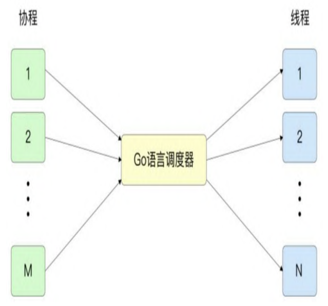

## 特点

1. 轻量级，一个占几kb左右（忽略内容占用的内存），比线程小得多；

2. 非抢占式

   线程的调度会有操作系统的干预，而go的协程并不属于os的资源，os是没办法调度的，只有go的编程者自己有能力来处理。如果开发者不处理，就不会干预。
3. 并发与并行同时存在
   
   go语言中的协程依托于线程，所以即便处理器运行的是同一个线程，在线程内，go语言调度器也会切换多个协程执行，这是协程是并发的。
   
   如果多个协程被分配给了不同的线程，而这些线程同时被不同的CPU核心处理，那么这些协程就是并行处理的。

## 进程与线程

在一个进程内部，可能有多个线程被同时处理。追求高并发处理、高性能的程序或者库，一般都会设计为多线程。

那为什么程序通常不采取为多进程，而是多线程的方式进行呢？原因主要有两点：

1. 开启一个新进程的开销要比开启一个新线程大的多；
2. 进程具有独立的内存空间，使得多进程之间的共享通信更加困难。

## 线程与协程

### 调度方式
go语言中的协程是从属于某一个线程的，协程与线程的对应关系为M:N,即多对多。go语言调度器可以将多个协程调度到一个线程中，一个协程也可以切换到多个线
程中执行。

### 上下文切换的速度
协程的上下文切换不需要经过操作系统用户态与内核态的转换，所以速度要快于线程。并且go语言中的协程切换只需要保留极少的状态和寄存器变量值(SP/BP/PC),

而线程切换会保留额外的寄存器变量值（例如浮点寄存器）。

上下文切换的速度受诸多因素影响，这里给出一些参考的量化指标：
1. 线程切换的速度大约为1~2微秒，
2. go语言中协程切换的速度为0.2微秒左右。
### 调度策略
### 栈的大小

